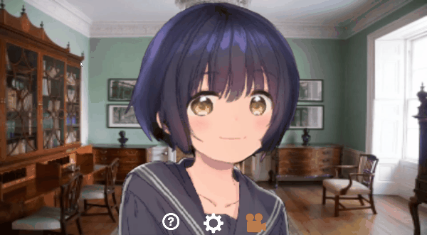

# Ganimation
## 概要
---
  
AIとPythonを使ってZoom等のコミュニケーションツールでアニメのキャラクターになりきれるアプリです。

## 使い方
---
アイコン付きの”Ganimation”をクリックすると実行されます。

**画像の条件**

1. お好きなアニメ顔画像を準備します
1. [コチラなど](https://www.remove.bg/ja)で背景の透過処理を行う
1. 四角の場所にドラッグ＆ドロップしてください
1. 読み込みが完了すればアニメキャラクターになりきれます！ 
 
## Requirement
---
以下を実行すればライブラリがインストールされます
~~~
conda env create -n ganimation -f ganimation_env.yml
~~~
**推奨スペック**

||条件|
----|----
|Python|3.6|
|GPU|RTX2070super|
|メモリ|16GB|
|cuda|10以上|

## Licence
---
Ganimation is under [GNU AGPLv3](https://choosealicense.com/licenses/agpl-3.0/)

## 参考
---
AIを作るうえで以下のサイトおよびコードを参考もしくは使用しました。

[Talking Head Animefrom a Single Image](https://pkhungurn.github.io/talking-head-anime/)

[talking-head-anime-demo](https://github.com/pkhungurn/talking-head-anime-demo)

